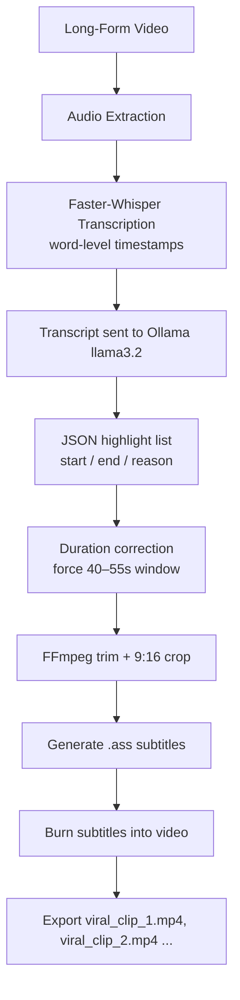

# 🎬 AI Clipping Agent


**AI-powered long-form to short-form video pipeline.** Turns podcasts, interviews, and webinars into ready-to-post vertical clips — auto-transcribed, auto-highlighted, and auto-captioned. Built on **Faster-Whisper** for transcription and a local **Ollama LLM** for highlight detection, with **FFmpeg** handling the vertical crop and burned-in subtitles.

---

## ✨ Features

- ⚡ Fast, word-level transcription via Faster-Whisper (GPU-accelerated)
- 🎯 LLM-based highlight detection — finds the most "clip-worthy" 40–55s moments automatically
- 🔧 Auto-correction: stretches/trims any AI-picked clip to fit the target duration window
- 🛟 Fallback auto-slicer if the LLM output is malformed (guarantees output every run)
- 📝 TikTok-style word-by-word `.ass` subtitle burn-in (9:16 vertical crop from 16:9 source)
- 💸 Zero cloud API cost — transcription and highlight-picking both run locally

---

## 🔧 Tech Stack

| Component | Tool |
|---|---|
| Transcription | `faster-whisper` |
| Highlight detection | `Ollama` (`llama3.2`) |
| Video rendering | `FFmpeg` |
| Language | `Python 3.10+` |

---

## 🧭 How It Works



> GitHub renders `mermaid` code blocks as live flowcharts automatically — no image upload needed.

---

## 🖥️ Full Setup Guide (Local PC)

> **Note:** the scripts are written Colab-style (`/content/drive/...` paths, `link_drive.py` for Drive mounting). This guide adapts the flow for a local machine — see Step 5 for the path swap.

### 1. Prerequisites

- Python 3.10+
- NVIDIA GPU + CUDA *(script defaults to `device="cuda"`; use `device="cpu"` and drop `compute_type="float16"` if you have no GPU)*
- FFmpeg installed and on PATH
- [Ollama](https://ollama.com) installed

### 2. Clone the repo

```bash
git clone https://github.com/RMIN06/Ai-Clipping-Tool-fast-whisper.git
cd Ai-Clipping-Tool-fast-whisper
```

### 3. Install Python dependencies

```bash
pip install faster-whisper ollama
```

(FFmpeg is a system binary, not a pip package — install it via your OS package manager: `sudo apt install ffmpeg` / `choco install ffmpeg` / `brew install ffmpeg`.)

Note: the scripts are written Colab-style (/content/drive/... paths, link_drive.py for Drive mounting). Below is the adapted local-PC flow — swap the paths as shown.

### 4. Pull the local LLM

```bash
ollama pull llama3.2
ollama serve   # keep this running in a separate terminal while the pipeline runs
```

### 5. Set your video path / swap Colab paths for local files

In `pipeline.py`, replace the Colab path example with your local file. Example:

```python
video_path = "./input/podcast.mp4"
```

And in `clip_renderer.py`, set the local output folder:

```python
OUTPUT_DIR = "./output/Viral_Clips"
```

> Skip `link_drive.py` entirely on a local machine — it exists only to mount Google Drive inside Colab.

4. Pull the local LLM
bash
ollama pull llama3.2
ollama serve   # keep this running in the background
5. Set your video path

## 📁 Project Structure

```
Ai-Clipping-Tool-fast-whisper/
├── pipeline.py         # Transcription + LLM highlight detection
├── clip_renderer.py    # FFmpeg trimming, cropping, subtitle burn-in
├── link_drive.py        # Google Drive mount helper (Colab only)
├── ollama.py            # Ollama client wrapper
└── README.md
```

with your local file, e.g.:

```python
video_path = "./input/podcast.mp4"
```

```python
OUTPUT_DIR = "./output/Viral_Clips"
```

to:

6. Run the pipeline in order

```bash
python pipeline.py         # transcribe + get highlight timestamps from the LLM
python clip_renderer.py    # trim, crop to 9:16, burn subtitles, export
```

Your finished clips land in:

```
./output/Viral_Clips/viral_clip_1.mp4
./output/Viral_Clips/viral_clip_2.mp4
...
```

## 🧠 The Core Prompt

This is the exact instruction `pipeline.py` sends to Ollama to extract highlight-worthy segments:

```text
You are an expert short-form video editor. Analyze this podcast transcript.
Find 5 to 7 engaging highlights.
CRITICAL RULE: Each highlight MUST have a duration between 40 and 55 seconds
(i.e., (end - start) must be between 40 and 55).
Return ONLY a strict JSON array of objects with keys: "start", "end", and "reason".
```

It's paired with `format="json"` in the Ollama call to force structured output. The pipeline then validates and corrects any clip outside the 40–55s window, and auto-slices the transcript into fixed intervals if the LLM's JSON response fails to parse.

## 🚀 Roadmap

- [ ] Multi-language transcription & subtitles
- [ ] Speaker detection
- [ ] AI-based virality scoring
- [ ] Batch processing for multiple videos
- [ ] Web UI for drag-and-drop uploads
- [ ] Auto title/description generation
- [ ] Direct publishing to YouTube Shorts / Instagram Reels / TikTok

## 📜 License

MIT — free to use, modify, and distribute.
